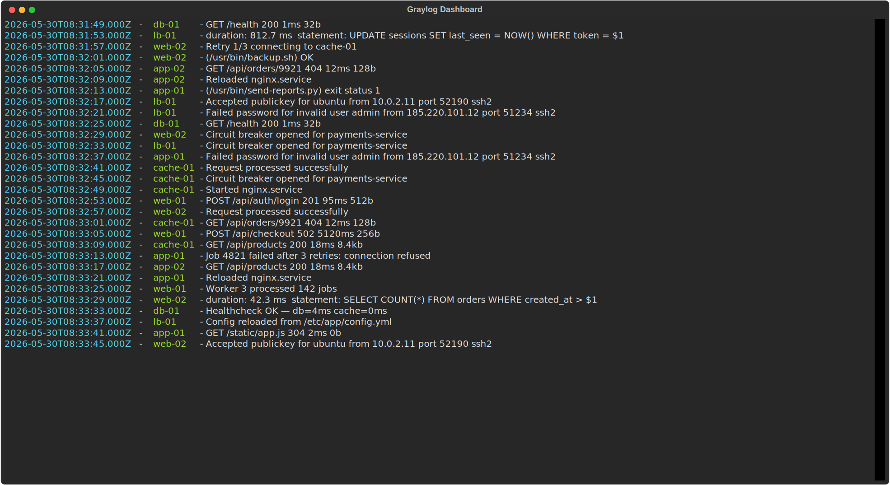
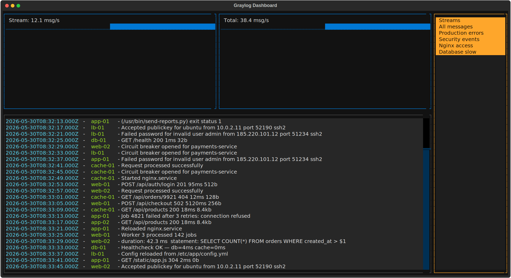

# graylog-tui

[](https://github.com/CygnusNetworks/graylog-tui/actions/workflows/ci.yml)
[](https://www.python.org/)
[](https://www.gnu.org/licenses/gpl-3.0)
[](https://github.com/astral-sh/ruff)

Terminal dashboard for Graylog — full-screen TUI by default, plain text when piped.

Inspired by [graylog-labs/cli-dashboard](https://github.com/graylog-labs/cli-dashboard), rewritten in Python with [Textual](https://github.com/Textualize/textual).

**Log tail** (default — `graylog-tui -H ... -s <stream-id>`):



**Dashboard** (`--gui` — charts + interactive stream selector):



## Installation

```bash
uv tool install git+https://github.com/CygnusNetworks/graylog-tui
```

Or for development:

```bash
git clone https://github.com/CygnusNetworks/graylog-tui
cd graylog-tui
uv sync
```

## Configuration

Create `~/.graylog_tui`:

```yaml
username: admin
password: yourpassword
host: https://graylog.example.com/api   # optional, can be passed via --host
```

## Usage

```bash
# Full-screen log tail (default when in a terminal)
graylog-tui -H https://graylog.example.com/api -s <stream-id>

# Select stream by name instead of ID
graylog-tui -H https://graylog.example.com/api --stream-title Errors

# Plain text — pipe-friendly, activates automatically when not in a terminal
graylog-tui -H https://graylog.example.com/api -s <stream-id> | grep ERROR
graylog-tui -H https://graylog.example.com/api -s <stream-id> > output.log

# Full dashboard TUI with charts and interactive stream selector
graylog-tui -H https://graylog.example.com/api --gui
```

## Modes

| Mode | When | How |
|---|---|---|
| Full-screen log tail | interactive terminal | default |
| Plain text | stdout is a pipe or file | automatic |
| Dashboard TUI | explicit | `--gui` |

### Keybindings (TUI modes)

| Key | Action |
|---|---|
| `q` / `Esc` | Quit |
| `Space` | Pause / resume |

## Options

```
-H, --host TEXT          Graylog base URL (e.g. https://graylog.example.com/api)
-s, --stream-id TEXT     Stream UUID
    --stream-title TEXT  Select stream by title (prefix match)
-g, --gui                Full dashboard TUI with charts and stream selector
    --align              Pad source hostnames to equal width
    --poll-interval INT  Poll frequency in milliseconds [default: 1000]
    --insecure           Skip TLS certificate verification
    --config PATH        Config file path [default: ~/.graylog_tui]
-v, --version            Show version and exit
```

## License

GPL-3.0-or-later
